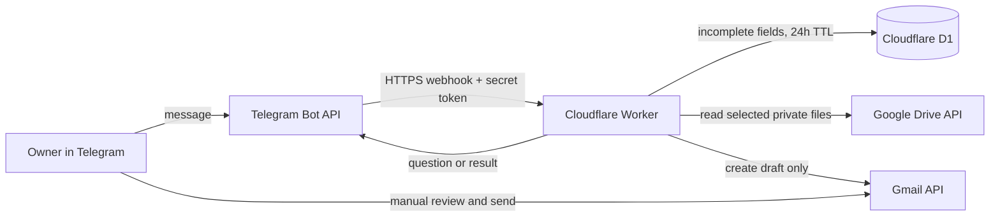

# Architecture decisions

Status: **initial product choices recorded; Google Cloud project and API setup complete**. Do not put credentials, OAuth tokens, numeric Telegram user IDs, or private file contents here.

## Project boundaries

- The selected messaging app is the request channel; Gmail drafts are the only email side effect.
- The agent must never send email. Google requires the `gmail.compose` scope for draft creation; that scope also permits sending, so enforce the no-send rule in the application by using the drafts API only and implementing no send operation.
- A draft is created once recipient details validate; the owner reviews and sends it manually in Gmail.
- Personalization uses the saved template and facts supplied by the owner. No unsupported claims or silent company research.
- Each request requires recipient name, recipient email, company name, job title, and job ID; these map to the approved template placeholders.
- Secrets and the resume stay outside source control. Routine logs omit Telegram user IDs, email addresses, message bodies, and attachment content.

## Data flow

## Data inventory

| Data | Location | Purpose | Retention/access |
| --- | --- | --- | --- |
| Telegram bot token, webhook secret, Google OAuth credentials | Cloudflare Worker secrets | Authenticate Telegram and Google API calls | Until rotated/revoked; owner only |
| Owner Telegram numeric user ID | Worker secret/config | Restrict bot use to one owner | Retained while service is active |
| Partial recipient/job details | D1 `conversations` table | Continue follow-up for missing fields | Expire/delete after 24 hours; one owner only |
| Email template and resume | Owner's private Google Drive files | Compose and attach drafts | Retained in owner's Drive; Worker reads only selected file IDs |
| Completed email body and resume bytes | Worker memory during a request | Build the Gmail MIME draft | Not intentionally persisted in D1 or logs |
| Gmail draft ID | Telegram confirmation; future operational metadata if needed | Help owner find a draft | No separate database copy in the initial scaffold |
| Routine diagnostic logs | Cloudflare observability | Troubleshooting | Disabled by default; never log message bodies or credentials |

## Decisions to resolve

| Decision | Current status | Recommended starting point |
| --- | --- | --- |
| Messaging channel | Selected: Telegram Bot API | Create a private bot via @BotFather; Telegram's Bot API is free. Restrict use to the owner's numeric Telegram user ID. |
| Hosting platform and region | Cloudflare account created; use Workers Free + D1 | Stay on the Free plan. Public HTTPS webhook and small durable state fit current free quotas for 10–50 requests/day. Free quotas can change or be exceeded, at which point requests may fail. |
| Runtime/application stack | Proposed: TypeScript on Cloudflare Workers | One runtime for webhook, conversation flow, and provider APIs; suitable for a small serverless workload. |
| State store | Proposed: Cloudflare D1 | Keep only short-lived incomplete request state and minimal completion metadata. |
| Template and resume storage/update process | Proposed: user's private Google Drive folder, with local copies retained | Use Google Picker plus the narrow `drive.file` scope, granting access only to explicitly selected files. Standard Drive API usage has no additional charge within published quotas. Do not make the folder public. A computer-only copy cannot be accessed by the hosted Worker. |
| Draft timing and review | User decision: create draft immediately after complete details validate; user reviews and sends manually in Gmail | No Telegram email preview or pre-creation approval. The draft must include the configured resume; missing/unreadable attachment fails the request. |
| Retention | Proposed: incomplete conversation state 24 hours; minimal completed request metadata 7 days; routine logs 7 days, with message bodies, email addresses, and Telegram user IDs redacted | Keep only what is needed for recovery; do not retain template/resume contents in request state or logs. |
| Authorized sender identity | One owner Telegram account, numeric user ID configured in local ignored Worker vars | Store the ID as protected configuration; never allowlist based on username or message text. |
| Duplicate request policy | User decision: duplicate detection is not required for now | A repeated inbound request can create another draft. Provider webhook retries could also repeat processing unless basic transport-level retry handling is used; user has chosen not to add semantic duplicate detection. |
| Development and production accounts | Telegram test bot and user's Gmail test account available | Keep production bot/token and target Gmail authorization separate until pilot succeeds. |

## Deployment details to record after choices are made

- Telegram bot setup, webhook secret-token method, inbound/outbound constraints, and configured callback URL.
- Google Cloud project: `Telegram Email Draft Agent` (`telegram-email-draft-agent`, project number `795741890232`). Gmail API, Drive API, and Picker API are enabled; the test Gmail is configured as the external OAuth test user, and the required scopes are declared. The project number is public configuration for Google Picker, not a credential.
- Deployed Worker URL: `https://telegram-email-drafting-agent.telegramemailagent.workers.dev`; the owner reports that Telegram webhook requests create Gmail drafts successfully.
- Hosting product, deployment region, public HTTPS URL, health-check URL, persistent-storage approach, and secret-management approach.
- Runtime and supported version; state-store product; development setup and dependency lockfile.
- Google Cloud project, Gmail API enablement, OAuth client type, consent-screen status, exact redirect URI(s), and draft-only scope. Never record client secrets or tokens here.
- Template/resume storage reference (not contents), allowed file types/size, and owner update procedure.
- Retention periods, authorized sender identity configuration method, and acknowledgment that retries may create duplicate drafts.
- Estimated recurring costs and provider limitations, when known.

## Still unresolved

Telegram is selected. Cloudflare Workers Free/D1 and TypeScript are proposed for 10–50 drafts/day; the user has created a Cloudflare account and D1 database in APAC (`telegram-email-agent-state`, UUID `73a0c89f-ed4d-46b9-8472-53e525303cb4`), and applied its initial migration. Google OAuth has been authorized locally and the template/resume selected through Picker using `drive.file`. Draft creation is immediate after valid input, with manual review/send in Gmail. Semantic duplicate detection is omitted for now. The Worker deployment and Telegram webhook URL remain outstanding. No secret values or private file contents belong in this note.
