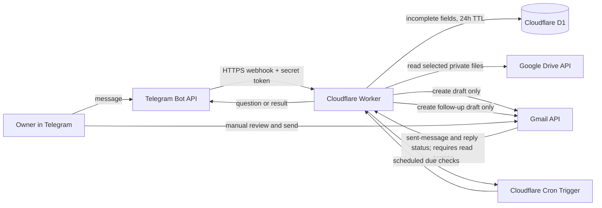

# Architecture decisions

Status: **original draft workflow deployed and owner-verified; follow-up workflow implemented locally and awaiting Google reauthorization, D1 migration, and redeployment**. Do not put credentials, OAuth tokens, numeric Telegram user IDs, or private file contents here.

## Project boundaries

- The selected messaging app is the request channel; Gmail drafts are the only email side effect.
- The agent must never send email. Google requires the `gmail.compose` scope for draft creation; that scope also permits sending, so enforce the no-send rule in the application by using the drafts API only and implementing no send operation.
- A draft is created once recipient details validate; the owner reviews and sends it manually in Gmail.
- Personalization uses the saved template and facts supplied by the owner. No unsupported claims or silent company research.
- Each request requires recipient name, recipient email, company name, job title, and job ID; these map to the approved template placeholders.
- Secrets and the resume stay outside source control. Routine logs omit Telegram user IDs, email addresses, message bodies, and attachment content.
- Follow-ups are limited to three drafts per original. They become eligible 3 days after the original is sent, then 5 days after follow-up 1 is sent, then 7 days after follow-up 2 is sent. Draft creation alone never advances the schedule.
- Any reply in the tracked Gmail conversation cancels future follow-ups. An already-created follow-up draft remains in Gmail for the owner to inspect; the agent does not delete it. All follow-ups remain drafts for manual review/send. Only follow-up 2 includes the configured resume.
- If a follow-up draft is still unsent 24 hours after creation, send one Telegram reminder; do not repeat it.

## Data flow

## Data inventory

| Data | Location | Purpose | Retention/access |
| --- | --- | --- | --- |
| Telegram bot token, webhook secret, Google OAuth credentials | Cloudflare Worker secrets | Authenticate Telegram and Google API calls | Until rotated/revoked; owner only |
| Owner Telegram numeric user ID | Worker secret/config | Restrict bot use to one owner | Retained while service is active |
| Partial recipient/job details | D1 `conversations` table | Continue follow-up for missing fields | Expire/delete after 24 hours; one owner only |
| Email template and resume | Owner's private Google Drive files | Compose and attach drafts | Retained in owner's Drive; Worker reads only selected file IDs |
| Completed email body and resume bytes | Worker memory during a request | Build the Gmail MIME draft | Not intentionally persisted in D1 or logs |
| Gmail draft ID | Telegram confirmation; future operational metadata if needed | Help owner find a draft | No separate database copy in the initial scaffold |
| Follow-up tracking record | D1, after follow-up feature is implemented | Associate original request, Gmail thread/message IDs, sent timestamps, next due time, and stopped/completed state | Retain only while follow-ups are active, then apply a defined cleanup period; owner only |
| Routine diagnostic logs | Cloudflare observability | Troubleshooting | Disabled by default; never log message bodies or credentials |

## Decisions to resolve

| Decision | Current status | Recommended starting point |
| --- | --- | --- |
| Messaging channel | Selected: Telegram Bot API | Create a private bot via @BotFather; Telegram's Bot API is free. Restrict use to the owner's numeric Telegram user ID. |
| Hosting platform and region | Cloudflare account created; use Workers Free + D1 | Stay on the Free plan. Public HTTPS webhook and small durable state fit current free quotas for 10–50 requests/day. Free quotas can change or be exceeded, at which point requests may fail. |
| Runtime/application stack | Proposed: TypeScript on Cloudflare Workers | One runtime for webhook, conversation flow, and provider APIs; suitable for a small serverless workload. |
| State store | Proposed: Cloudflare D1 | Keep only short-lived incomplete request state and minimal completion metadata. |
| Template and resume storage/update process | Proposed: user's private Google Drive folder, with local copies retained | Use Google Picker plus the narrow `drive.file` scope, granting access only to explicitly selected files. Standard Drive API usage has no additional charge within published quotas. Do not make the folder public. A computer-only copy cannot be accessed by the hosted Worker. |
| Draft timing and review | User decision: create draft immediately after complete details validate; user reviews and sends manually in Gmail | No Telegram email preview or pre-creation approval. The draft must include the configured resume; missing/unreadable attachment fails the request. |
| Retention | Proposed: incomplete conversation state 24 hours; minimal completed request metadata 7 days; routine logs 7 days, with message bodies, email addresses, and Telegram user IDs redacted | Keep only what is needed for recovery; do not retain template/resume contents in request state or logs. |
| Authorized sender identity | One owner Telegram account, numeric user ID configured in local ignored Worker vars | Store the ID as protected configuration; never allowlist based on username or message text. |
| Duplicate request policy | User decision: duplicate detection is not required for now | A repeated inbound request can create another draft. Provider webhook retries could also repeat processing unless basic transport-level retry handling is used; user has chosen not to add semantic duplicate detection. |
| Follow-up schedule | User confirmed: 3 days after original sent; then 5 days after follow-up 1 sent; then 7 days after follow-up 2 sent | Timers begin at Gmail's actual sent timestamp. An unsent draft pauses progression. Maximum three follow-up drafts. |
| Follow-up send behavior | User decision: draft each follow-up for manual send | No automated sending. Only follow-up 2 includes the resume attachment. |
| Unsent draft reminder | User decision: one reminder is acceptable | Send one Telegram reminder 24 hours after a follow-up draft is created if it remains unsent; no repeated reminders. |
| Reply cancellation | User decision: any reply stops future follow-ups | Leave an already-created draft untouched for owner inspection; do not delete it. |
| Follow-up templates | User decision: use a template for each follow-up | Store separate private templates (one per follow-up); validate placeholders and required fields as for the initial email. |
| Development and production accounts | Telegram test bot and user's Gmail test account available | Keep production bot/token and target Gmail authorization separate until pilot succeeds. |

## Deployment details to record after choices are made

- Telegram bot setup, webhook secret-token method, inbound/outbound constraints, and configured callback URL.
- Google Cloud project: `Telegram Email Draft Agent` (`telegram-email-draft-agent`, project number `795741890232`). Gmail API, Drive API, and Picker API are enabled; the test Gmail is configured as the external OAuth test user, and the required scopes are declared. The project number is public configuration for Google Picker, not a credential.
- Deployed Worker URL: `https://telegram-email-drafting-agent.telegramemailagent.workers.dev`; the owner reports that Telegram webhook requests create Gmail drafts successfully.
- Hosting product, deployment region, public HTTPS URL, health-check URL, persistent-storage approach, and secret-management approach.
- Runtime and supported version; state-store product; development setup and dependency lockfile.
- Google Cloud project, Gmail API enablement, OAuth client type, consent-screen status, exact redirect URI(s), and the `gmail.compose`, `gmail.readonly`, and `drive.file` scopes. The code must still use draft creation only. Never record client secrets or tokens here.
- Template/resume storage reference (not contents), allowed file types/size, and owner update procedure.
- Retention periods, authorized sender identity configuration method, and acknowledgment that retries may create duplicate drafts.
- Estimated recurring costs and provider limitations, when known.

## Follow-up implementation and operational constraints

The local Worker code now includes scheduled tracking, reply checks, and follow-up draft creation. It is not active in the deployed Worker until the owner adds the Gmail read scope, reauthorizes, applies D1 migrations, and deploys. The current local Google setup now requests `gmail.compose`, `gmail.readonly`, and `drive.file`. The app must continue to call only Gmail draft creation and must not call any send endpoint.

An optional short-interval test mode is available for owner verification. Deploy with `FOLLOWUP_TEST_MODE=true` and a temporary every-minute Cron Trigger; newly tracked requests then use 60-second delays. Each row records whether it was created in test mode. Turning the setting off pauses test rows from creating further drafts/reminders, while normal rows retain their configured 3/5/7-day delays. Restore the hourly Cron Trigger after the test. See the README for the test procedure.

Recommended operating rules:

1. Store the Gmail thread ID as soon as each draft is created. Start its timer only after Gmail no longer has that draft and a matching sent message appears in that thread; do not start when the draft is merely created.
2. Create one follow-up draft when due and no reply exists. Associate it with the original Gmail thread so replies remain discoverable as one conversation.
3. Start the next timer only after Gmail confirms the previous follow-up was sent. If a due draft remains unsent, do not create repeated copies or progress to the next step. Send one Telegram reminder 24 hours after draft creation if it is still unsent; do not repeat the reminder.
4. Gmail history is synchronized once per hour; check the Gmail thread again immediately before creating each due draft. A due draft may therefore be created up to about one hour after its timer expires. A reply arriving after that final check can still race with draft creation, so the system provides best-effort suppression rather than an atomic guarantee.
5. Preserve a stopped state after reply detection so a later timer or delayed Gmail sync cannot restart follow-ups.
6. Keep three separate templates in private Drive and use explicit placeholders. Attach the resume only to follow-up 2.
7. Use elapsed 24-hour periods for 3/5/7-day delays. The current scheduler runs hourly and creates up to four due drafts per run (up to 96 per day); a large simultaneous backlog can delay later drafts by multiple runs.

The user has confirmed the timing, attachment, reminder, and existing-draft behavior described above. No further product decisions are required. The local implementation is ready for account setup and deployment; a reply stops future follow-up creation, while any draft already created remains for the owner to inspect.

## Still unresolved

Telegram is selected. Cloudflare Workers Free/D1 and TypeScript are used for the low-volume workflow; the user created the APAC D1 database (`telegram-email-agent-state`, UUID `73a0c89f-ed4d-46b9-8472-53e525303cb4`) and applied its initial migration. The original Google OAuth authorization and selected files are configured. The Worker is deployed at the URL recorded above, and the owner reports successful original draft creation. Semantic duplicate detection is omitted. Follow-up code is implemented locally and awaits expanded Google authorization, migration `0002`, and redeployment. No secret values or private file contents belong in this note.
